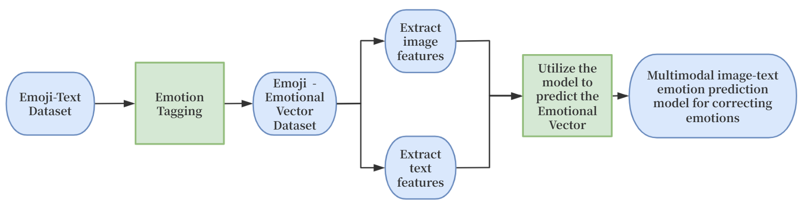
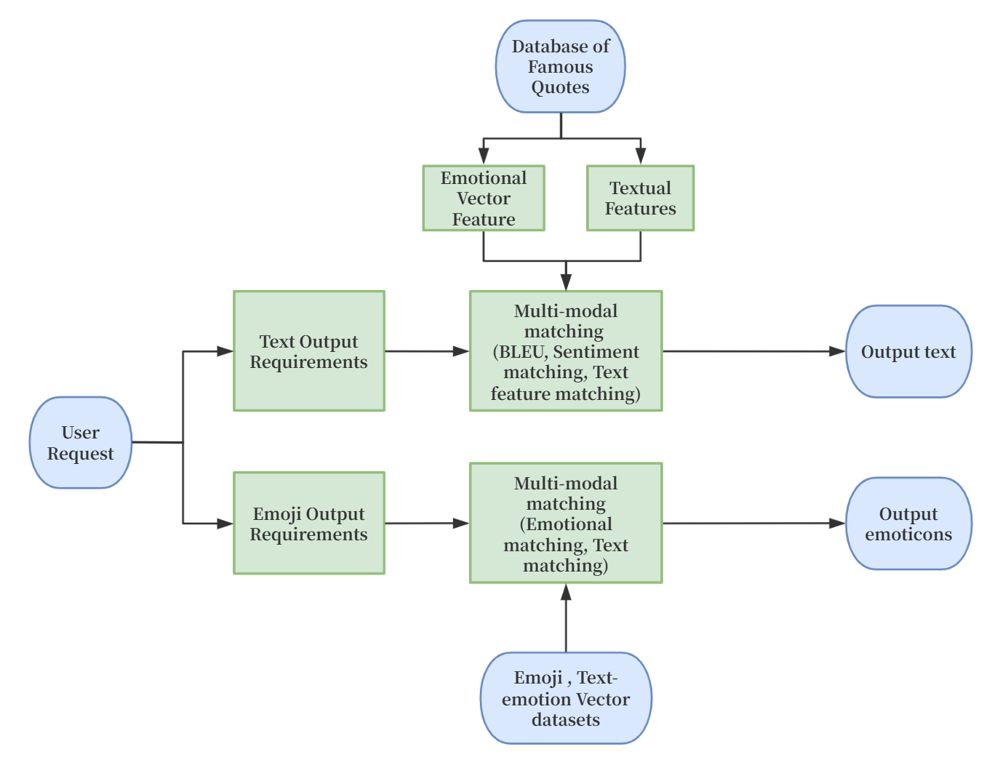
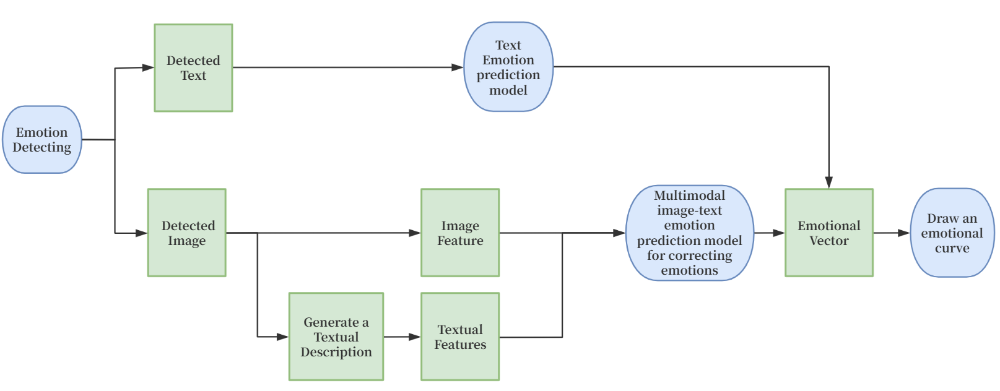

本项目启动需要在Hugging Face上下载对应的预训练模型的文件到models中
1. https://huggingface.co/google-bert/bert-base-chinese
2. https://huggingface.co/Salesforce/blip-image-captioning-large
3. https://huggingface.co/openai/clip-vit-base-patch32
4. https://huggingface.co/IDEA-CCNL/Erlangshen-Roberta-330M-Sentiment
5. https://huggingface.co/Varine/opus-mt-zh-en-model

本地模型训练：python image_text_feature_creator_model_define.py
训练完毕后可以通过：streamlit run qianduan/visual_test.py 启动前端

本地语料库通过 对 text_data_creator.py 中的dataset做添加后运行 python text_data_creator.py 完成添加。

项目主要流程图如下：

本项目已经开源至 https://github.com/yoki320220939/AMultimodal-Emotion-Aware-Conversational-Assistant-with-Sentiment-Regression-and-Expression-Matching